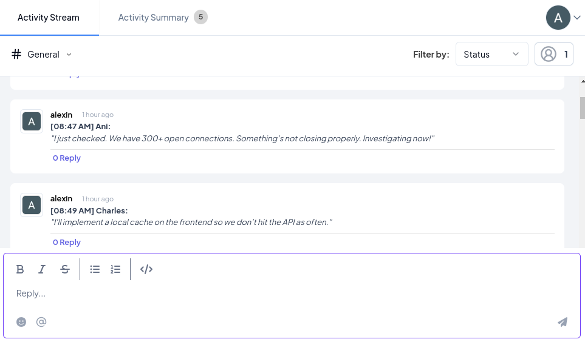
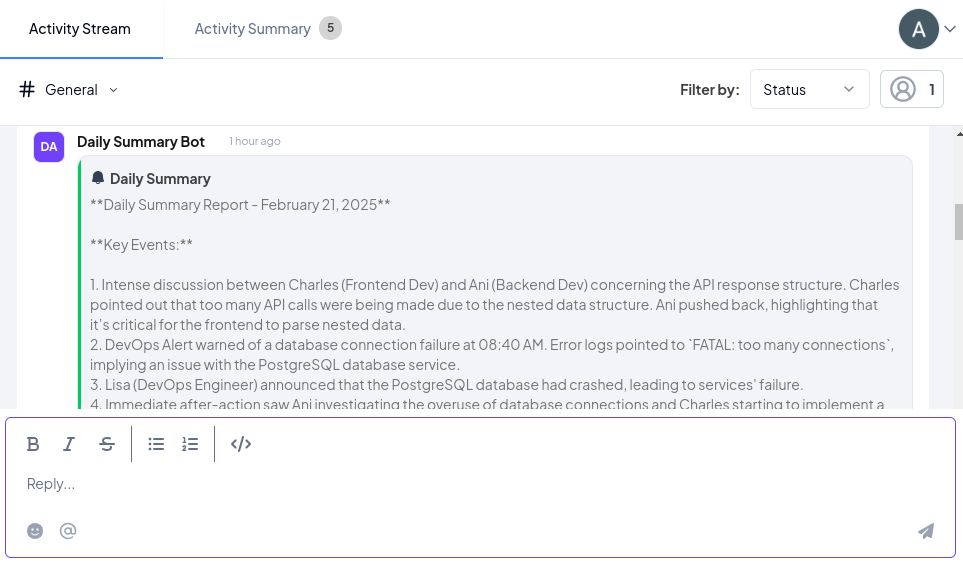

# 📢 Daily Summary Generator - Telex Integration  

The **Daily Summary Generator** is a Telex integration that **automatically compiles and summarizes messages** from a Telex channel every 24 hours (or at a configured interval).  
It provides **clear, structured reports** of the day's conversations, helping teams track key discussions, issues, and resolutions.

---

## 🚀 Features

### ✅ **Automated Daily Summaries**

- Collects messages from the past 24 hours in a **Telex channel**.
- Generates a structured summary using **OpenAI's GPT-4 API**.
- Posts the summary back to Telex via the provided `return_url`.

### ✅ **Smart Categorization**

- Summarizes messages into key sections:
  - 🐛 **Bugs & Issues**  
  - 🚀 **Deployments & Fixes**  
  - 🔐 **Security Alerts**  
  - 🔌 **Infrastructure Issues**  

### ✅ **Supports OpenAI API Key from Settings**

- The integration **retrieves the OpenAI API key** from the settings, ensuring secure and customizable AI usage.

### ✅ **Handles Missing Messages Gracefully**

- If no messages are found, the bot responds with `"No messages to show."`, ensuring users get relevant updates.

### ✅ **Error Handling & Reporting**

- If an issue occurs (e.g., invalid API key, OpenAI API failure), an **error message is sent to the return URL**.

### ✅ **Flexible Scheduling**

- Users can **configure the summary generation interval** using cron-like syntax (`0 8 * * *` for daily at 8 AM).

---

## 🛠️ Setup & Configuration  

### **1️⃣ Install Dependencies**

```bash
npm install
```

### **2️⃣ Configure Environment Variables**

Create a `.env` file with the following keys:

```plaintext
MONGO_URI=mongodb://localhost:27017/telex_db
```

### **3️⃣ Start the Server**

```bash
npm run dev
```

---

## 🔧 Configuration Options

The integration settings allow customization:

| **Setting** | **Description** | **Example Value** |
|------------|----------------|------------------|
| `interval` | Cron expression for summary frequency | `"0 8 * * *"` (daily at 8 AM) |
| `openai_api_key` | OpenAI API key for generating summaries | `"sk-..."` |

---

## 📸 Screenshots

  


---

## ⚠️ Error Handling

- If OpenAI API fails, an **error message is sent** to the `return_url`.  
- If the API key is missing or invalid, a **notification is sent** back to Telex.

---

## 🔗 Related Links  

- 📜 [Telex API Docs](https://telex.im/docs)  
- 🧠 [OpenAI API Docs](https://platform.openai.com/docs)  

---

## 📬 Contact  

👨‍💻 Developed by **Alexin**  
📧 Email: [alexindevs](mailto://alexindevs@gmail.com)
